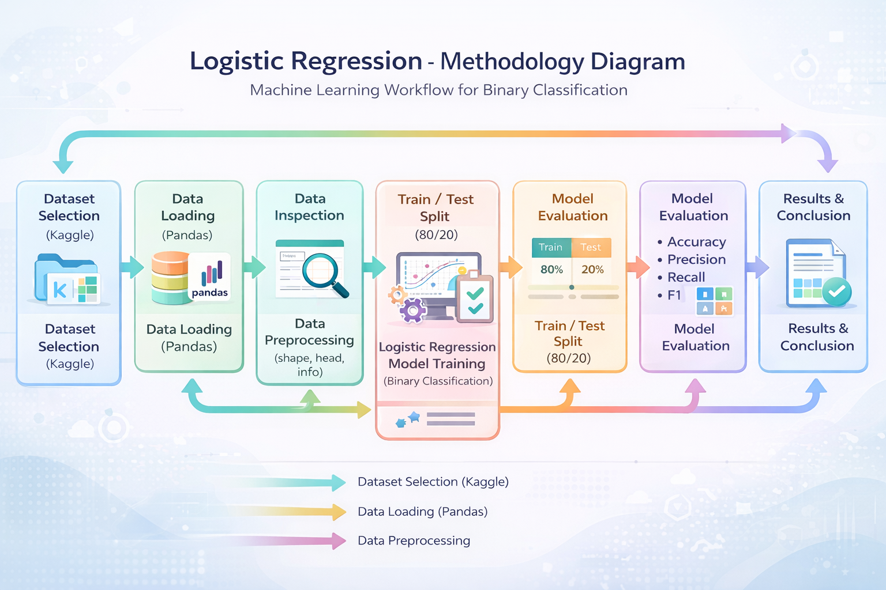

# ARTI-308: Lab 2 – Identifying ML Problems & Methodology

This lab explores how to identify a machine learning problem, select an appropriate dataset, and plan the workflow using a methodology diagram.

**Note:** This lab focuses on the early stages of a machine learning project and does not include a final model.

---

## Dataset Selection
The dataset used in this lab was selected from **Kaggle**.  
It is a tabular breast cancer dataset provided in CSV format and contains demographic, clinical, and tumor-related features.

---

## Problem Definition
The objective of this lab is to predict the survival status of breast cancer patients based on medical and demographic features.

### Problem Type
This is a **supervised learning** problem formulated as a **binary classification** task.

### Target Variable
- **Status**: Indicates the patient outcome (e.g., alive or deceased).

---

## Dataset Overview
The dataset includes features such as:
- Patient demographics (e.g., age, race, marital status)
- Tumor characteristics (e.g., tumor size, stage, grade)
- Hormone receptor status (estrogen and progesterone)
- Survival information

---

## Methodology
The following diagram illustrates the planned machine learning workflow for this lab, starting from dataset selection and ending with model evaluation and results.

*The methodology diagram was created using an AI tool to visually explain the workflow.*
